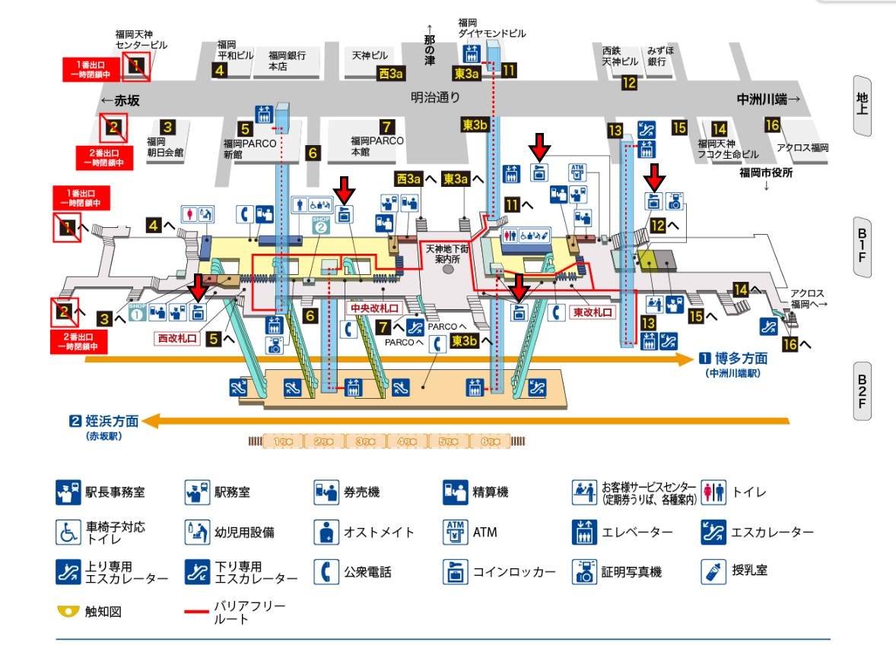

## 목표
- 준혁이와 부자여행 떠나기
- 준혁이가 하루 일정 정하기

## 여행 전 확인
- [x] 항공권 예약 확인
- [x] 숙소 예약 확인
- [x] 여권 유효기간 확인
- [x] 일본 엔화 환전: 30,000엔
- [x] 이심 사기
- [x] 비상약 준비: 탁센, 코메키나, 지사제
- [x] 버스투어 예약 확인 (5/17)
- [x] 야나가와 뱃놀이 예약
- [x] 여행자 보험 가입
- [x] 마린월드 예매
- [x] 후쿠오카타워 예매
- [x] 교통패스 확인
- [x] 쿠라스시 예약
- [x] 보조배터리 파우치
- [x] 보조배터리 충전
- [x] 비지트재팬 등록
- [x] 인천공항 스마트패스

## 일정

| 일자          | 시간            | 장소                                                                  | 비고                                                                     |
| ----------- | ------------- | ------------------------------------------------------------------- | ---------------------------------------------------------------------- |
| **5/15(목)** | 22:00         | 수학학원                                                                | 준혁이 픽업                                                                 |
|             | 22:30 ~ 23:30 | 이동                                                                  |                                                                        |
|             | 23:30 ~ 06:30 | 취침                                                                  |                                                                        |
| **5/16(금)** | 06:35 ~ 09:35 | 인천공항 2터미널 - 샤워실                                                  | 아침 먹기 **비행기에서 먹을 것 사기**                                             |
|             | 09:35 ~ 11:05 | 비행                                                                  |                                                                        |
|             | 11:05 ~ 12:00 | 후쿠오카공항                                                              | **바우처 교환: 국제선 터미널 1층  도착 출구 오른쪽 HIS 카운터**                           |
|             | 12:00 ~ 12:20 | 지하철(공항 -> 덴진)                                                      |                                                                        |
|             | 12:20 ~ 12:30 | 덴진 역                                                                | 캐리어 보관                                                                 |
|             | 12:30 ~ 13:40 | 지하철(텐진 -> 야나가와)                                                     |                                                                        |
|             | 14:30 ~ 15:30 | 야나가와 뱃놀이                                                            | 아이스크림                                                                  |
|             | 15:30 ~ 16:00 | 저녁(장어덮밥)                                                            | 롯큐                                                                     |
|             | 16:30 ~ 18:00 | 이동 - 지하철                                                            |                                                                        |
|             |               | 호텔                                                                  | 체크인                                                                    |
|             |               | 요도바시카메라                                                             |                                                                        |
| **5/17(토)** | 06:00         | 기상                                                                  |                                                                        |
|             | 06:30~07:00   | 조식                                                                  |                                                                        |
|             | 07:20         | 호텔 출발                                                               |                                                                        |
|             | 07:30 ~ 07:40 | 로손 오리엔탈호텔 후쿠오카점                                                     |                                                                        |
|             | 1시간           | 다자이후(텐만구)                                                           |                                                                        |
|             | 3시간           | 유후인 - 누루카와 온센 - 긴린코 호수 - 플로랄 빌리지 - 금상 고로케 - 나카쓰 가라아케 |  **수건 챙기기**  누루카와 가족탕: 2600엔 금상 고로케: 200엔 나카 가라아게: 520엔 |
|             | 30분           | 유후타케                                                                |                                                                        |
|             | 40분           | 벳부 가마도지옥 온천                                                         | 온천물 계란, 사이다                                                         |
|             | 18:30 ~ 19:00 | 로손 오리엔탈호텔 후쿠오카점                                                     |                                                                        |
|             | 19:30 ~ 20:30 | 쿠라스시                                                                |                                                                        |
|             |               | 포켓몬센터                                                               |                                                                        |
| **5/18(일)** | 07:00         | 기상                                                                  |                                                                        |
|             | 07:30 ~ 08:00 | 조식                                                                  |                                                                        |
|             | 08:30 ~ 09:00 | 도보                                                                  |                                                                        |
|             | 09:00 ~ 09:30 | 라쿠스이엔                                                               | 정원만, 잉어먹이주기                                                            |
|             | 09:30 ~ 11:00 | 지하철 (하카타 -> 가시이 -> 우미노나카미치)                                      |                                                                        |
|             | 11:00 ~ 14:30 | 마린월드 우미노나카미치 - 돌고래쇼  - 점심                                     | 돌고래쇼(11:00, 12:30) 대수조쇼(11:15, 12:45) 물개(13:45)                  |
|             | 14:30 ~15:00  | 도보, 표끊기                                                             |                                                                        |
|             | 15:00 ~ 15:20 | 페리(사이토자키 -> 모모치)                                                    |                                                                        |
|             | 15:20 ~ 16:30 | 모모치 해변, 후쿠오카타워                                                      |                                                                        |
|             | 16:30 ~ 17:00 | 버스                                                                  |                                                                        |
|             | 17:00 ~ 18:00 | 후쿠오카 성터                                                             |                                                                        |
|             | 18:00 ~ 18:40 | 저녁(야키니쿠 라이크)                                                        |                                                                        |
|             | 18:40 ~ 19:00 | 버스                                                                  |                                                                        |
|             | 19:00 ~20:00  | 캐널시티 - 분수쇼(19:30) - 점프샵(지하1층) - 대니 츄러스                     |                                                                        |
|             |               | 호텔                                                                  | 목욕탕                                                                    |
| **5/19(월)** | 06:30         | 기상                                                                  |                                                                        |
|             | 07:00 ~ 07:30 | 호텔                                                                  | 짐맡기기                                                                   |
|             | 07:30 ~ 08:00 | 하카타역                                                                | 벤또사기                                                                   |
|             | 08:00 ~ 08:30 | 가고시마 본선(하카타 -> 훗코다이마에)                                           |                                                                        |
|             | 08:36 ~ 08:50 | 버스(훗코다이마에 -> 신구항)                                                   | 1번, 100엔                                                               |
|             | 09:20 ~ 09:40 | 페리                                                                  |                                                                        |
|             | 09:40 ~       | 아이노시마                                                               |                                                                        |
|             | 11:30 ~ 11:50 | 페리                                                                  |                                                                        |
|             | 12:14 ~ 12:30 | 버스(신구항 -> 훗코다이마에)                                                   | 2번, 100엔                                                               |
|             | 12:30 ~ 13:30 | 가고시마 본선(훗코다이마에 -> 다케시타)                                             |                                                                        |
|             | 13:30 ~ 15:30 | 라라포트                                                                |                                                                        |
|             | 15:30 ~ 16:00 | 버스                                                                  |                                                                        |
|             | 16:00 ~ 16:10 | 호텔                                                                  | 짐찾기                                                                    |
|             | 16:10 ~ 16:40 | 이동                                                                  |                                                                        |
|             | 16:40 ~ 19:35 | 후쿠오카공항                                                              | 닷사이23 루이스 초콜릿(56번 탑승구)                                              |
|             | 19:35 ~ 21:00 | 비행                                                                  |                                                                        |

## 링크
- 야나가와 뱃놀이: http://www.ensen24.jp/kippu/kr/dazaifu-yanagawa02/
- 쿠라스시: https://kurasushi.j-server.com/LUCKURACO/ns/tl.cgi/https://www.kurasushi.co.jp/first_kura/?SLANG=ja&TLANG=ko&XMODE=0&XJSID=0
- 마린월드 쇼 시간표: https://marine-world.jp/show_schedule/post-6248/
- 하카타만 페리 시간표: https://yasuda-gp.net/hakata/momochi_hakata

## 비용
- 항공편: 35만원 × 2명 = 70만원
- 숙소: 45만원
- 버스투어: 12만원
- 야나가와 뱃놀이: 33838원 + 17820원 = 51658원
- 마린월드: 22744원 + 10918원 = 33662원
- 후쿠오카 타워: 7177월 + 4486원 = 11663원

- 캐리어 보관: 1000엔
- 야나가와 뱃놀이 아이스크림: 350엔 * 2 = 700엔
- 장어덮밥: 3000엔 * 2 = 6000엔
- 유후인 누루카와 온센: 2600엔
- 유후인 금상 고로케: 200엔 * 2 = 400엔
- 유후인 나카 가라아게: 520엔
- 유후인 점심:
- 벳부 가마도지옥 온천 계란: 350엔
- 벳부 가마도지옥 온천 사이다: 220엔
- 라쿠스이엔: 100엔 * 2 = 200엔
- 라쿠스이엔 잉어먹이: 100엔

- 현지 교통비: 3160엔 * 2 = 6320엔
  - 후쿠오카 공항 -> 덴진: 260엔 * 2 = 520엔  
  - 하카타 -> 가시이 -> 우미노나카미치: 560엔 * 2 = 1120엔
  - 후쿠오카타워 -> 후쿠오카 성터: 260엔 * 2 = 520엔
  - 후쿠오카 성터 ->야키니쿠 라이크: 210엔 * 2 = 420엔
  - 야키니쿠 라이크 -> 캐널시티: 210엔 * 2 = 420엔
  - 캐널시티 -> 호텔: 210엔 * 2 = 420엔
  - 하카타 -> 신구항: 440엔 * 2 = 880엔
  - 신구항 -> 라라포트: 540엔 * 2 = 1080엔
  - 라라포트 -> 호텔: 210엔 * 2 = 420엔
  - 호텔 -> 후쿠오카 공항: 260엔 * 2 = 520엔
- 모모치 페리: 1200엔 * 2 = 2400엔
- 신구항 -> 아이노시마: 1480엔 * 2 = 2960엔
- 아이노시마 -> 신구항: 1480엔 * 2 = 2960엔

- 식비: 
- 기타 활동비: 

## 준비물
### 서류 & 돈
- [x] 여권 사본
- [x] 비행기 티켓
- [x] 영문 등본
- [x] 이심 QR코드
- [x] 숙소 바우처
- [x] 각종 예약 확인증
- [x] 현금: 30000엔
- [x] 신용카드: 트래블월렛, 트래블로그, npay머니 등
- [x] 비지트 재팬: 입국신고, 세관신고
### 전자제품
- [x] 휴대폰
- [x] 스마트워치
- [x] 노트북
- [x] 노트북 충전기
- [x] 보조배터리, 파우치
- [x] 핸드폰 충전기
- [x] 스마트워치 충전기
- [x] 셀카봉
- [x] 멀티어댑터
### 의류 & 악세사리
- [x] 상하의
- [x] 속옷
- [x] 잠옷
- [x] 양말
- [x] 선글라스
- [x] 모자
- [x] 동전지갑
- [x] 개인 가방
- [x] 보조백(보스턴백)
- [x] 우산
- [x] 우비
- [x] 볼펜
### 세면 & 미용용품
- [x] 치약, 칫솔, 치실
- [x] 물티슈
- [x] 클렌징폼
- [x] 로션
- [x] 선크림
- [x] 빗
- [x] 면도기
- [x] 손톱깍이
- [ ] 샤워타월
### 상비약
- [x] 두통약: 탁센
- [x] 코감기약
- [x] 지사제
- [x] 안약
- [x] 연고
- [x] 밴드
- [ ] 체온계
- [x] 코피솜
- [x] 비타민
- [x] 인공눈물
### 들고다닐 것
- [ ] 여권
- [ ] 출력물
- [ ] 보조배터리
- [ ] 셀카봉
- [ ] 우산
- [ ] 물티슈
- [ ] 두통약
- [ ] 선글라스
- [ ] 모자
- [ ] 안약
- [ ] 인공눈물
- [ ] 우비
- [ ] 손톱깍이

## 메모
### 먹고싶은 음식
- 회전초밥 - 쿠라스시
- 야키니쿠 - 야키니쿠 라이크
- 대니츄러스
- 오하요 크림브륄레(세븐일레븐)
- 사바테츠
- 츠케멘

### 식당
- 라멘스타디움(캐널시티)
- 사바타로
- 텐텐테이
- 로피아 하카타 요도바시점

### 관광지
- 마린월드 우미노나카미치
- 건담파크(라라포트)
- 야나가와
- 요도바시카메라 하카타 B1(가챠샵)
- 라쿠스이엔
- 포켓몬센터
- 나카스강 유람선
- 후쿠오카성터
- 모모치해변

### 살것
- 가쿠빈
- 닷사이23
- 건담
- 마리오
- 포켓몬
- 루이스 생초콜릿